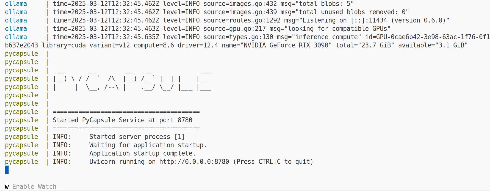
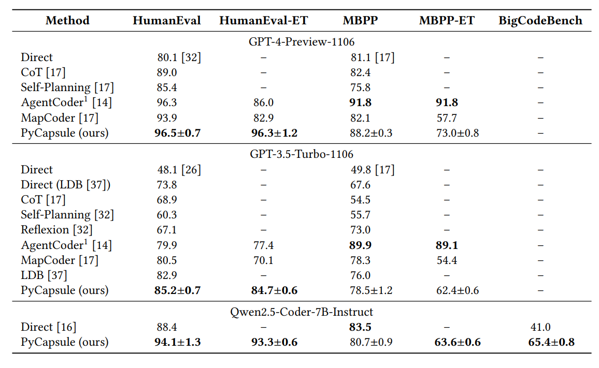

# PyCapsule

[](https://opensource.org/licenses/MIT)
[](https://arxiv.org/abs/2408.04910)
[](https://arxiv.org/abs/2502.02928)
[](https://www.python.org)

PyCapsule is a self-debugging python code generation framework, consisted of 2 Agents, automated pipelines and efficient self-debugging modules. PyCapsule features sophisticated prompt inference, iterative error handling, and case testing, ensuring high generation stability, safety, and correctness. Empirically, PyCapsule achieves up to 5.7% improvement of success rate on HumanEval, 10.3% on HumanEval-ET, and 24.4% on BigCodeBench compared to the state-of-art methods.  
This is a standlone Docker implementation that can work with official ```Ollama``` image.

## Prerequisites

Before you begin, ensure you have the following installed:

- [Docker](https://docs.docker.com/engine/install/ubuntu/) with appropriate user privileges for running Docker commands
- Python 3.9.19
- [Optional] Nvidia GPU and Cuda toolkit (for Ollama, see [Ollama](https://hub.docker.com/r/ollama/ollama) requirements)

## Installation

1. Clone the repository:
  ```bash
  git clone https://github.com/TheOpenSI/SYNKRASIS.git
  cd synkrasis
  git checkout -b PyCapsule origin/PyCapsule
  ```
2. Create external docker volume - 
```bash
docker volume create shared_mount
```
3. Run the docker compose file - 
 ```bash
 docker compose up
 ```

## Figures



## API Endpoints

### 1. Configuration Update (/config)

Update system configuration parameters:

```bash
curl -X POST localhost:8780/config \
  -H 'Content-Type: application/json' \
  -d '{
    "model_medium": "ollama",
    "model_name": "qwen2.5-coder"
  }'
```

### 2. Query Handling (/query)

Send queries to the system:

```bash
curl -X POST localhost:8780/query \
  -H 'Content-Type: application/json' \
  -d '{
    "query": "your query here"
  }'
```

### 3. Environment Variables (/setenv)

Set environment variables like API keys:

```bash
curl -X POST localhost:8780/setenv \
  -H 'Content-Type: application/json' \
  -d '{
    "HUGGING_FACE_TOKEN": "your-token",
    "OPENAI_API_KEY": "your-key"
  }'
```

## Publication



If you find this repository helpful, please cite the paper - 
```
@article{adnan2025large,
  title={Large Language Model Guided Self-Debugging Code Generation},
  author={Adnan, Muntasir and Xu, Zhiwei and Kuhn, Carlos CN},
  journal={arXiv preprint arXiv:2502.02928},
  year={2025}
}
```