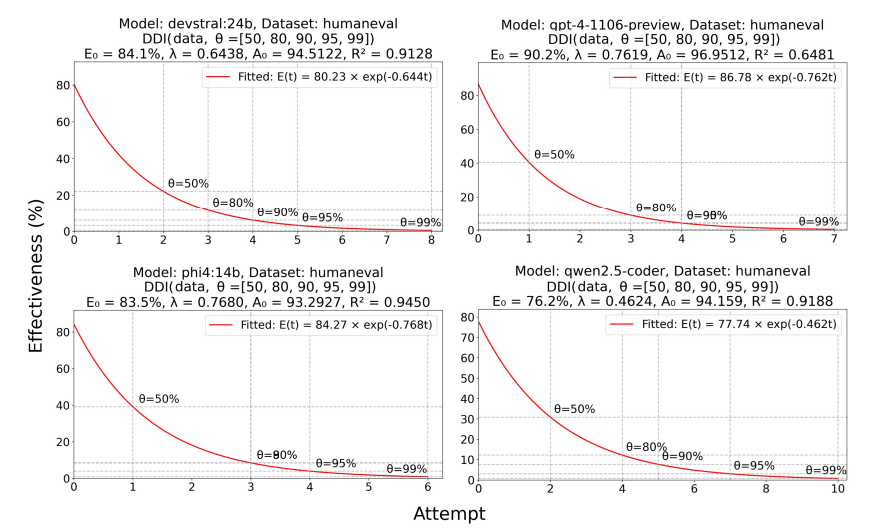
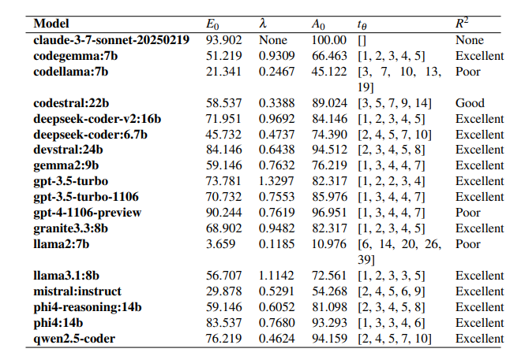
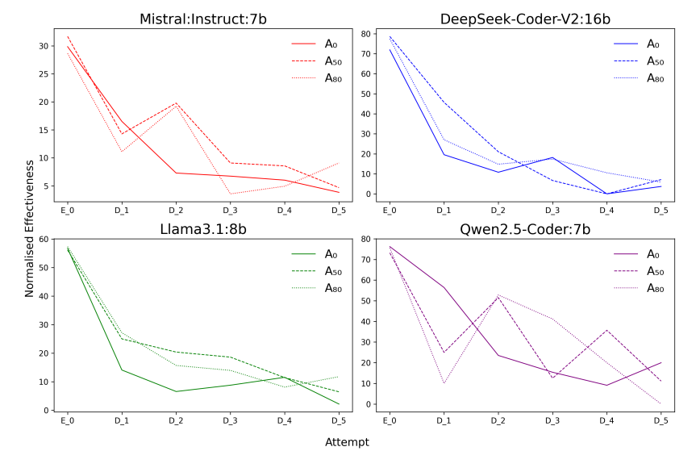

# The Debugging Decay Index (DDI): Rethinking Debugging Strategies for Code LLMs

[](https://opensource.org/licenses/MIT)
[](https://arxiv.org/abs/2506.18403)
[](https://doi.org/10.1038/s41598-025-27846-5)

## Abstract

The effectiveness of AI debugging follows a predictable exponential decay pattern; most models lose 60-80% of their debugging capability within just 2-3 attempts, despite iterative debugging being a critical capability for practical code generation systems. We introduce the **Debugging Decay Index (DDI)**, a mathematical framework that quantifies when debugging becomes ineffective and predicts intervention points. Our strategic fresh start approach shifts from exploitation to exploration at strategic points in the debugging process, demonstrating that well-timed interventions can rescue the effectiveness of debugging.



## Key Contributions

**Mathematical Framework**: Introduced exponential decay function E(t) = E₀ · e^(-λt) to model debugging effectiveness and calculate strategic intervention points.

**DDI Evaluation Metric**: A four-element tuple (E₀, λ, t_θ, R²) that captures initial performance, decay rate, optimal intervention points, and model fit quality.

**Strategic Fresh Starts**: Demonstrated that reinitialisation at DDI-calculated thresholds improves accuracy without additional computational costs.

## Experimental Results



We evaluated 18 state-of-the-art language models on HumanEval, revealing distinct debugging characteristics:

- GPT models exhibit fast effectiveness decay, reaching 80% threshold by attempts 2-3
- Models like Codestral-22B demonstrate sustained debugging with lower decay rates
- Claude-3.7-Sonnet achieved 100% effectiveness within two attempts

**Fresh Start Improvements:**
- Llama3.1:8B: 72.56% → 82.82% (+10.26%)
- DeepSeek-Coder-V2:16B: 84.1% → 92.1% (+8.0%)
- Mistral:Instruct: 54.3% → 62.8% (+8.5%)



## Research Questions

**RQ1 (Debugging Window)**: How many debugging attempts maximise effectiveness before diminishing returns?

**RQ2 (DDI Framework)**: How can we comprehensively assess LLM debugging capabilities beyond traditional pass@k metrics?

**RQ3 (Strategic Fresh Starts)**: Can strategic interventions at optimal timing overcome debugging decay patterns?


## Citation

```bibtex
@article{ddi_adnan,
  title={Measuring and mitigating debugging effectiveness decay in code language models},
  author={Adnan, Muntasir and Kuhn, Carlos CN},
  journal={Sci Rep 15},
  year={2025},
  doi = {https://doi.org/10.1038/s41598-025-27846-5}
}
```
